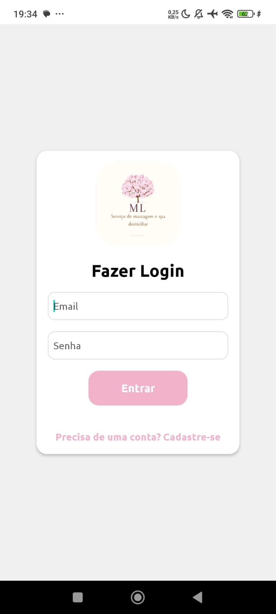
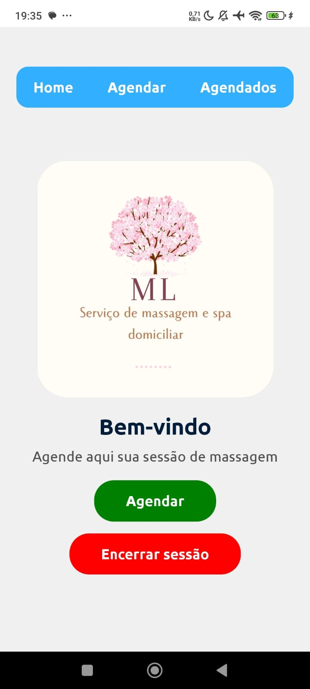
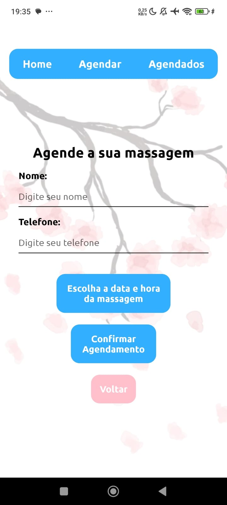
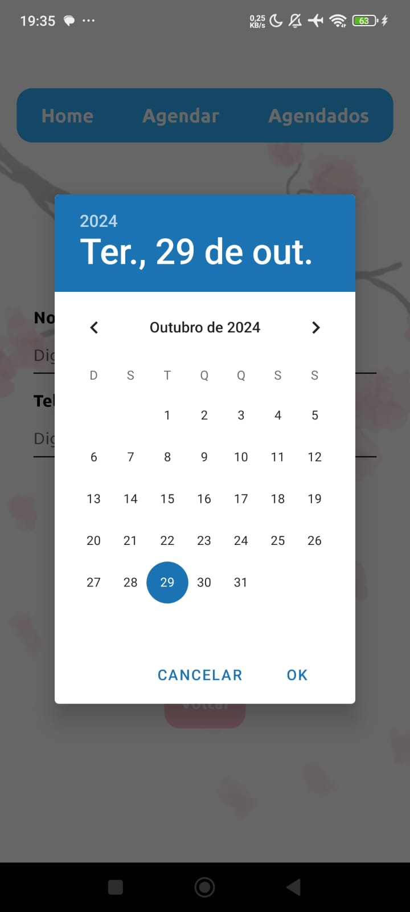
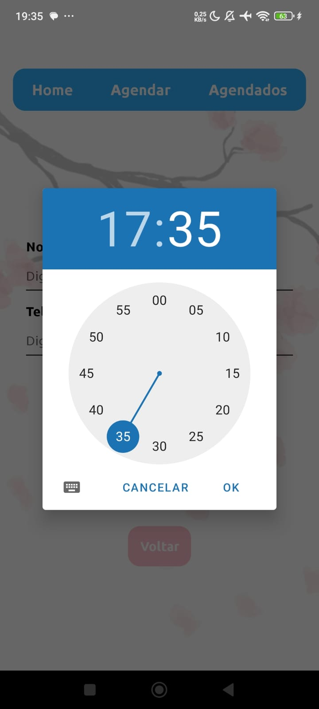
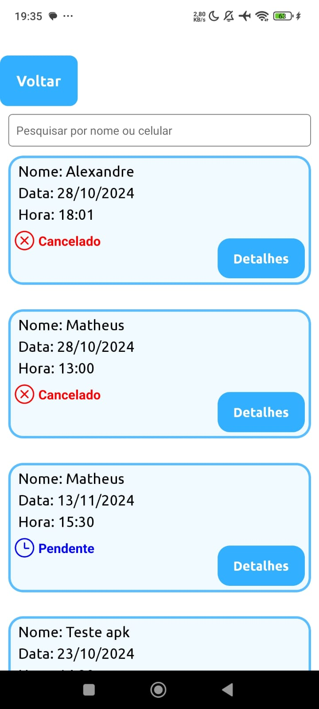

# App para Agendamento de Massagens

Um aplicativo desenvolvido durante um projeto de extensão na estácio para a disciplina Programação em Dispositivos Móveis Android para um massagista. O aplicativo permite agendar massagens, oferecendo diferentes interfaces para clientes e massagistas.

## Descrição

Este App para Agendamento de Massagens facilita o agendamento de sessões de massagem, proporcionando uma experiência intuitiva tanto para os clientes quanto para os massagistas. Os clientes podem visualizar a disponibilidade do massagista e agendar horários de acordo com sua conveniência, enquanto os massagistas podem gerenciar seus agendamentos de forma simples.

## Funcionalidades

- **Cadastro de Clientes**: Permite que novos clientes se cadastrem no sistema.
- **Agendamento de Massagens**: Clientes podem selecionar horários disponíveis para agendar massagens.
- **Gerenciamento de Agendamentos**: Massagistas podem visualizar e gerenciar suas sessões agendadas.

## Tecnologias Utilizadas

- **React Native**: Uma biblioteca para construir aplicativos móveis usando JavaScript e React, permitindo desenvolvimento multiplataforma para iOS e Android.

- **Expo**: Um conjunto de ferramentas e serviços que facilitam o desenvolvimento e a construção de aplicativos React Native, oferecendo recursos como visualização instantânea e gerenciamento de dependências.

- **TypeScript**: Uma linguagem que estende o JavaScript, adicionando tipagem estática, o que melhora a manutenção e a escalabilidade do código.

- **Firebase**: Uma plataforma de desenvolvimento de aplicativos móveis e web que oferece serviços como autenticação, banco de dados em tempo real e hospedagem, facilitando a implementação de funcionalidades back-end.

## Pré-requisitos

- React Native 0.76+
- Expo 51.0 +
- TypeScript 5.3.3+
- Firebase
- Editor de Texto ou IDE de sua preferência (ex: VsCode, Vim, Android Studio, etc)
- Terminal de sua preferência (ex: GitBash, PowerShell, Zsh, etc )
- Sistema Operacional: Linux, macOS ou Windows
- Node.js
- npm

## Instalando o projeto
1. Clone o repositório:

Primeiro, clone o repositório:
```bash
git clone https://github.com/MathLPblue/MassagistaApp.git
```
Em seguida, entre na pasta criada:
```bash
cd MassagistaApp
```
E então, instale as dependências:
```bash
npm install
```
Por fim, inicie o projeto:
```bash
npx expo start
```

## Telas do Aplicativo

### Tela de Autenticação

Tela para que o usuário possa logar.

---

### Tela Inicial

Tela inicial exibida após a autenticação do usuário.

---

### Tela de Agendamento

Tela onde o usuário pode agendar mensagens.

#### Tela de Escolha de Data

Escolha a data do agendamento.

#### Tela de Escolha de Hora

Escolha a hora do agendamento.

---

### Tela de Agendamentos Semanais

Tela para acompanhar os agendamentos programados para a semana.

---

### Tela de Todos os Agendamentos

Tela que exibe todos os agendamentos realizados, independentemente da data.
